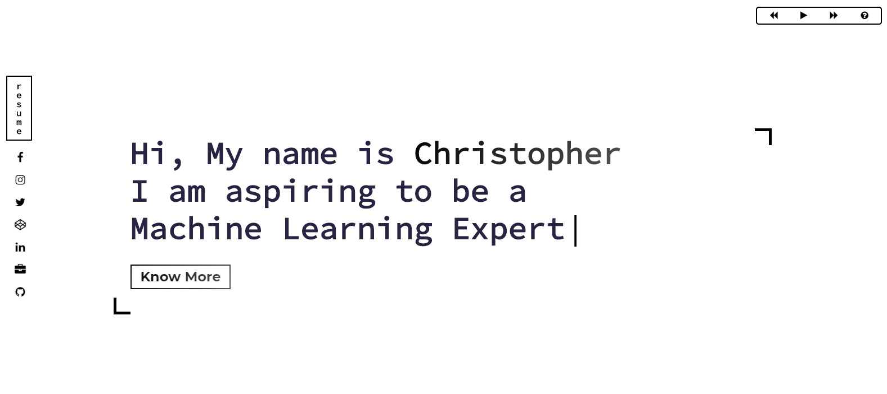

# My Portfolio ⚡️   

## Screenshots

## Technologies used 🛠️

- [Gatsby](https://www.gatsbyjs.org/) - Static Site Generator
- [GraphQL](https://graphql.org/) - Query language for APIs
- [React](https://es.reactjs.org/) - Front-End JavaScript library
- [Bootstrap 4](https://getbootstrap.com/docs/4.3/getting-started/introduction/) - Front-End UI library
- [Sass](https://sass-lang.com/documentation) - CSS extension language

## Authors

- **Christopher Lim** - [https://github.com/cc-visionary](https://github.com/cc-visionary)

## License 📄

This project is licensed under the MIT License - see the [LICENSE.md](LICENSE.md) file for detail

## Acknowledgements

Would like to acknowledge [Datasette](http://datassette.net/) for providing [http://musicforprogramming.net/](http://musicforprogramming.net/) where I was able to use [Episode 1: Datasette](http://musicforprogramming.net/?one) for my website.
